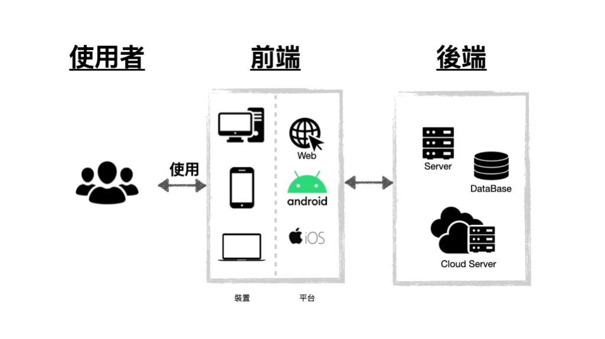
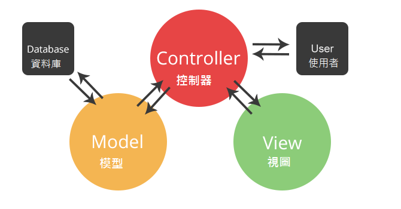

# 第三周：ReactJS
## 前置-甚麼是React： [React 文件](https://zh-hant.reactjs.org/)
> React是一個Javascript工具庫，專注於狀態管理及DOM的處理，並可透過額外的工具庫來達成Router實作或更多的功能。  
--- 

## 前後端分離的概念

[圖源](https://ithelp.ithome.com.tw/articles/10231011)  
1. 前端負責將資料呈現給使用者，可以是Web、Android、ios或任何直接與使用者交互的媒介，需要考慮使用者的操作體驗  
2. 後端負責與前端交互，處理資料的提供、收取、邏輯計算及儲存的功能。
3. 前後端的傳遞資料多用Web API做存取，API可以提供一個統一格式，達成單一後端與多重前端進行交互的服務，可見參考資料[RESTful API](https://aws.amazon.com/tw/what-is/restful-api/)  
---  

## MVC的概念  
  
[圖源](https://bak.infolight.com/new/ShareDetail.aspx?DocumentID=NDUz)  
MVC是一種設計模式，將整個系統分成三個部分。MVC分別代表Model、View、Controller，三個部分相互作用可以幫助開發人員更容易開發、維護系統。    
1. Model(模型)：主要負責資料的儲存及邏輯處理，與Controller溝通。  
2. View(視圖)：負責內容的呈現，與Controller溝通。  
3. Controller(控制器)：負責與Model、View進行聯繫，負責邏輯業務處理。    
---  

## 前後端分離的MVC概念
參考資料: [TechBridge 技術共筆部落格-前後端分離與 SPA](https://blog.techbridge.cc/2017/09/16/frontend-backend-mvc/)  
1. 前端僅負責收取資料，將資料處理好呈現給使用者，並將收取到的資料處理好傳送給後端，原本MVC中Model的功能則交由後端取代。  
2. 後端負責收發前端與前端溝通的資料，將收取到的資料進行邏輯處理，並回傳資料或將資料與資料庫進行連接進行後續處理，原本MVC中View的功能則交由前端取代。  
---  

## npm是什麼  
> npm（全名：Node Package Manager）是一個開源的套件管理器，專門用於 Node.js 的應用程式開發。npm 允許開發者方便地分享和重複使用 JavaScript 的程式碼和套件，並通過一個命令行介面安裝、管理和升級這些套件。

> npm 創建於 Node.js 的早期階段，並隨著 Node.js 的普及而迅速發展。如今，npm 已成為 JavaScript 生態系統中最重要的套件管理器之一，擁有數以百萬計的套件可供開發者使用。通過使用 npm，開發者可以輕鬆地引入第三方庫，如 jQuery 和 React，以及其他工具和框架，以便於開發 Node.js 應用程式。  

[Source: ChatGPT](chat.openai.com)

簡單來說，npm就是一個js的套件管理工具，概念有點類似於python的pip(Package Installer for Python)，而我們將透過這個工具來快速加載react相關的Library。  
參考資料: [node.js](https://nodejs.org/zh-tw)  

---  
## DOM (Document Object Model) 文件物件模型
* HTML DOM ：  
    由 browser 創建，可以理解為一個能夠操作 HTML 內容的結構。  
* React Virtual DOM :  
    基於 React Library，並不直接與 HTML DOM 關聯，僅載React 內容有需要更改內容時透過 ReactDOM.render() 將內文 render 到 HTML DOM 上。  

---  
