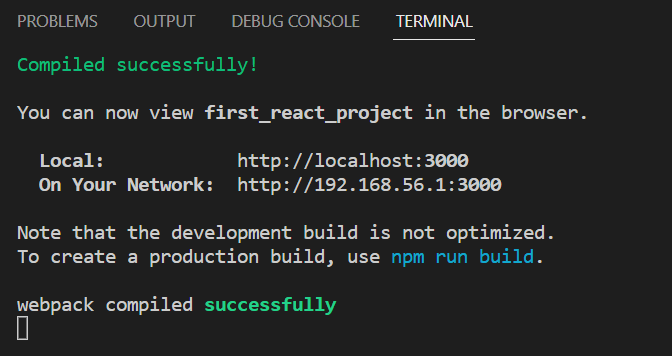
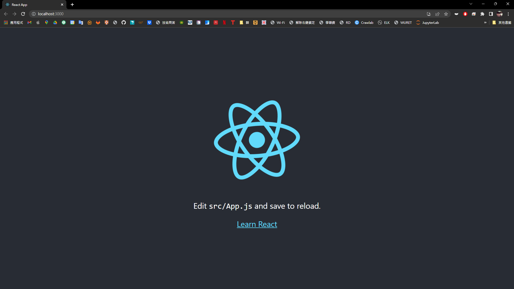
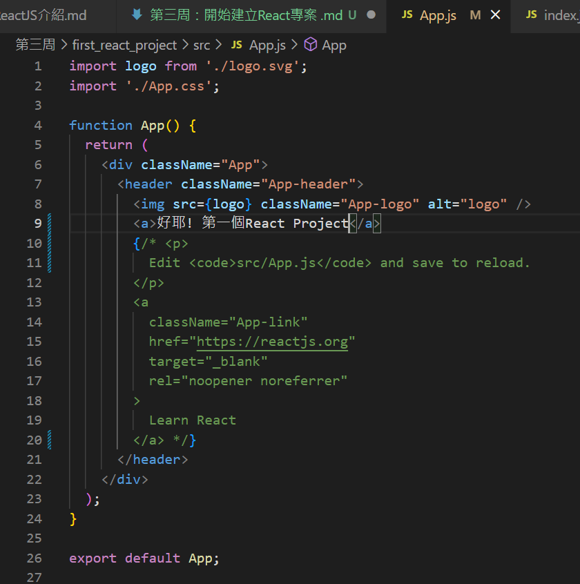
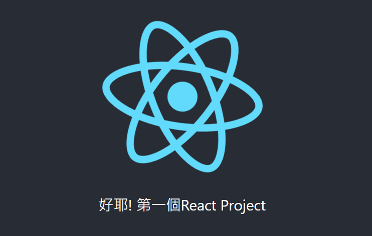
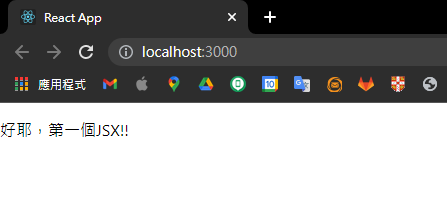

# 第三周：開始建立React專案 
## 1. 安裝 node.js  
[node.js](https://nodejs.org/zh-tw)  

---  
## 2. 到目標資料夾輸入  
```
npx create-react-app {專案名稱}
```  

我們可以看到目錄下方多了一個資料夾，這邊專案名稱以 **first_react_project** 為例，然後我們可以進入這個專案資料夾觀察裡面的結構。  
```
first_react_project/
  README.md
  node_modules/
  package.json
  public/
    index.html
    favicon.ico
  src/
    App.css
    App.js
    App.test.js
    index.css
    index.js
    logo.svg
```  
* ```public/index.html``` 唯一的 html 檔案，頁面模板建構最基本的 DOM 元素。
* ```src:js``` 程式和 css 檔案在 src 內，否則不會被打包工具打包。  
* ```src/index.js``` 將元件 render 到 index.html ,這個檔案不可以改名。  
* ```src/App.js``` 建構元件,這個檔案不可以改名。  
* ```node_modules``` 開發者用 npm/yarn 所載下來的套件會放在這裡。  
* ```package.json:React``` 專案設定檔，設定各項工具。  
* ```package-lock.json``` 紀錄專案用 npm/yarn 下載了那些套件。  
---  
## 3. 啟動 React 專案
```
cd first_react_project
npm start
```  
你會看到 terminal 有以下情況  
  
此時你便可以嘗試連線到 ```http://localhost:3000``` 查看專案的檢視。  
  

---  
## 4. 嘗試更改 browser 中的元件  
我們可以在 src/index.js 中看見第4行 import 了 App 進來  
  

進入 src/App.js 中，可以看見 App 的 component  
  

嘗試更改 function App()的內容，可以看見 Browser 的內容有所更動
  

---  
## 5. JSX 
* JSX 一次只傳遞單一元素  
* 使用 JSX 並非必要，也可單純使用 Javascript 處理 HTML  
* 使用 JSX 有兩種做法
```
const root = ReactDOM.createRoot(document.getElementById('root'));

const jsx_element = <p>好耶，第一個JSX!!</p>;
root.render(jsx_element,document.getElementById('root'))
```  
或  
```
const root = ReactDOM.createRoot(document.getElementById('root'));

root.render(<p>好耶，第一個JSX!!</p>.getElementById('root'))
```
* 註：此處的 root 對應到 public/index.html 的 ```<div id='root'></div>```  

執行結果：  
  

延伸學習及練習：  
1. CodePen [JSX tag p](https://www.w3schools.com/react/showreact.asp?filename=demo2_react_render1)  
2. CodePen [JSX table](https://www.w3schools.com/react/showreact.asp?filename=demo2_react_render2)  
3. Reactjs.org [Fragemnt(用於回傳多個element)](https://zh-hant.reactjs.org/docs/fragments.html)  
4. ithome [React.js 入門 JSX(下)](https://ithelp.ithome.com.tw/articles/10216468)  
5. Reactjs.org [介紹JSX](https://zh-hant.reactjs.org/docs/introducing-jsx.html)  
6. Reactjs.org [深入JSX](https://zh-hant.reactjs.org/docs/jsx-in-depth.html)  

---  

## 6. Component  
React Components有兩種寫法：  
* Class components:  以 ES6 Class 宣告，可以執行較複雜的操作，較耗費資源  
* Function components:  以 Javascript function 宣告，不需要控制生命週期建議使用  

<br/>
1. Class components  

```
const root = ReactDOM.createRoot(document.getElementById('root'));

class Smile extends React.Component{ //Component開頭要大寫
  render(){
    return(
      <h1>:)</h1>
    )
  }
}

root.render(<Smile />,document.getElementById('root'));
```  
<br/>
2. Function Components  

```
const root = ReactDOM.createRoot(document.getElementById('root'));

function Smile(){ //Component開頭要大寫
  return(
    <h1>:)</h1>
  )
}

root.render(<Smile />,document.getElementById('root'));

```
也可以用箭頭函式  
```
const root = ReactDOM.createRoot(document.getElementById('root'));

const Smile = () => ( //Component開頭要大寫
    <h1>:)</h1>
);

root.render(<Smile />,document.getElementById('root'));
```


3. 若 Component 在個別檔案中，則需要將其 export，並在要引用的檔案中 import  
```
//This is Smile.js

import React from 'react';

class Smile extends React.Component{ //Component開頭要大寫
  render(){
    return(
      <h1>:)</h1>
    )
  }
}

export default Smile;
```
```
//This is index.js

import React from 'react';
import ReactDOM from 'react-dom';
import Smile from './Smile.js';

const root = ReactDOM.createRoot(document.getElementById('root'));

root.render(<Smile />,document.getElementById('root'))

```
參考資料： [MDN](https://developer.mozilla.org/zh-TW/docs/Web/JavaScript/Reference/Statements/export)  

