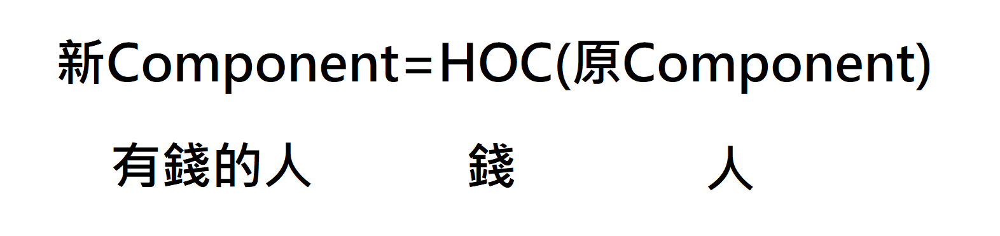
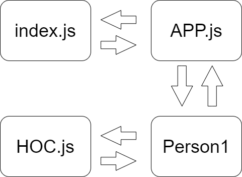
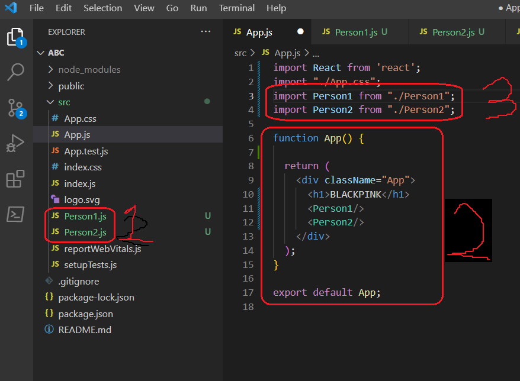
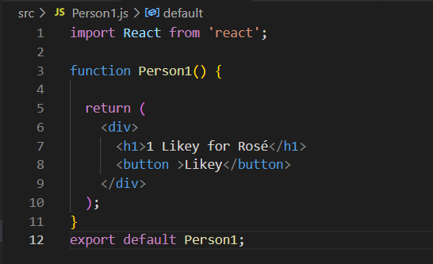
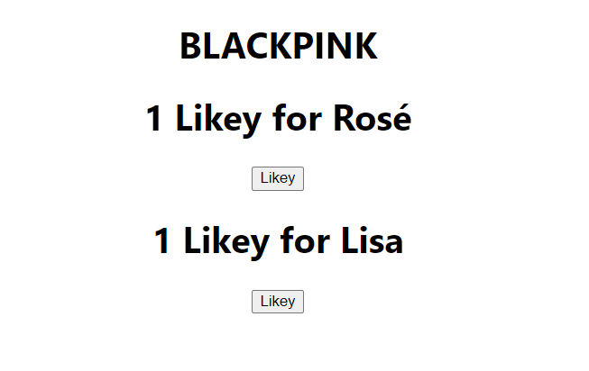
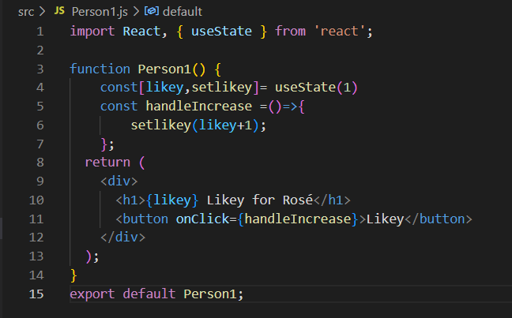
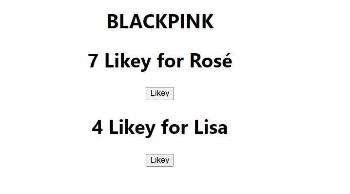
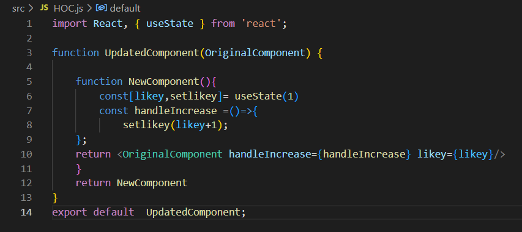
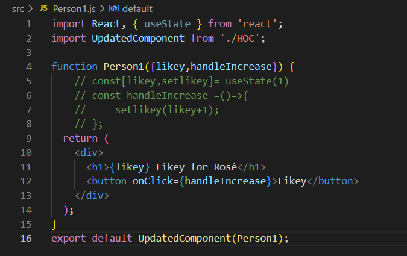
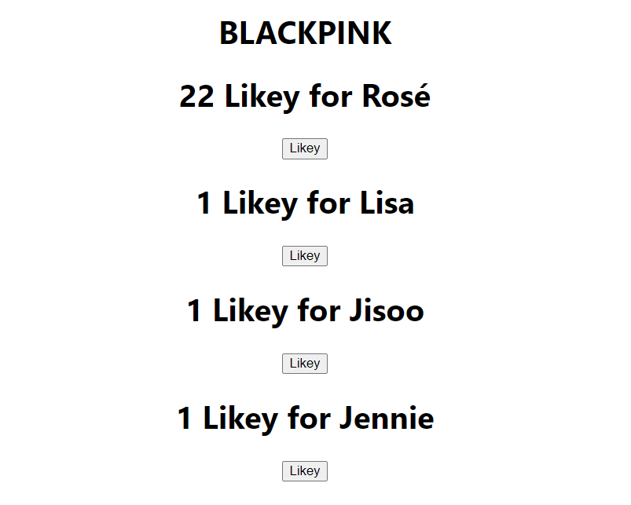

# 第五週:HOC介紹&範例(BLACKPINK按讚按鈕)
全名Higher Order Component，將原本component的一部分function獨立出來做成一個新的component，讓其他component要用到新component的功能時可以更加方便  
概念  

流程圖  

## 1. 建立一個react專案  
[如何建立react專案](https://github.com/Bighsueh/NFUReact2023/blob/main/%E7%AC%AC%E4%B8%89%E5%91%A8/%E7%AC%AC%E4%B8%89%E5%91%A8%EF%BC%9A%E9%96%8B%E5%A7%8B%E5%BB%BA%E7%AB%8BReact%E5%B0%88%E6%A1%88%20.md)  

---  
## 2. 主畫面設置  
 因為預設index.js是render App.js的畫面，所以把App.js作為主畫面
### (1) 在src裡面建立兩個component(Person1,Person2)
### (2)  App要render的內容，包含上述兩個component
### (3) import Person1跟Person2  
 
---  
## 3. Person1,Person2內容 
  標題跟一個按紐  
    
  ```
import React from 'react';

function Person1() {

  return (
    <div className="App">
      <h1>{內容}</h1>
      <button>likey</button>
    </div>
  );
}

export default Person1;
```
  
  畫面 按鈕按不會有反應  
  
   
---  
## 4. 設定按紐
設定兩個props，likey(數值)以及setlikey(function)，設likey的初始值為1。
設定一個function叫handleIncrease，內容是setlikey這個function為likey+1，設定按紐。按一下執行handleIncrease。
將標題的數字改為likey的value。  
   
```
const[likey,setlikey]= useState(1)
        const handleIncrease =()=>{
            setlikey(likey+1);
            }
```
畫面  


---  
## 5. 建立HOC檔案 
src裡面新增一個component(HOC.js)，把會重複用到的component(設定likey、setlikey)丟到HOC裡面。
回傳handleIncrease這個function以及likey的值。  
  
```
import React, { useState } from 'react';

function UpdatedComponent(OriginalComponent) {
    
    function NewComponent(){
        const[likey,setlikey]= useState(1)
        const handleIncrease =()=>{
            setlikey(likey+1);
    };
    return <OriginalComponent handleIncrease={handleIncrease} likey={likey}/>
    }
    return NewComponent
}
export default  UpdatedComponent;
```
## 6. 修改Person1&2  
計算likey的程式碼改到HOC中，在第2行引入HOC的script，在第4行的Person1加入兩個props，第16行的輸出改為帶入Person1的HOC的回傳值。 
輸出畫面改為經過HOC的Person1 function。  

## 7. 套用HOC增加新的component
增加兩個新的component  
畫面  


參考資料： [HOC example](https://www.youtube.com/watch?v=J5P0q7EROfw)
