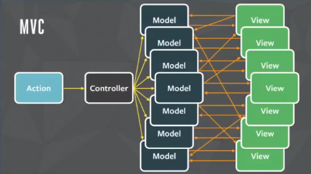
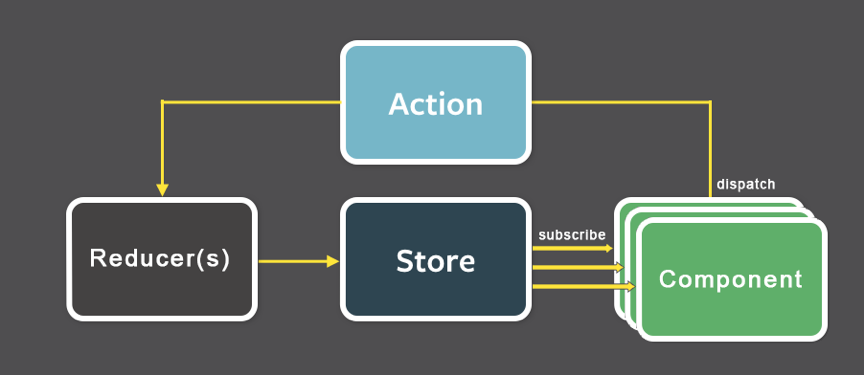
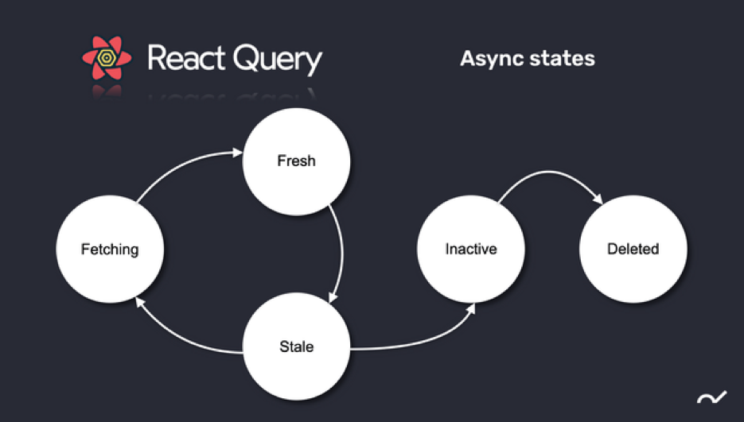
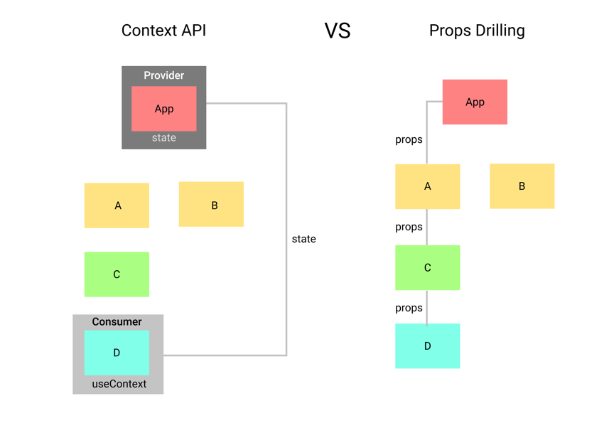

＃第六週 – ReactJS與Redux
什麼是Redux？簡單的說，如下圖




在傳統的 MVC 架構下，Model 和 View 之間可能會呈現複雜關係，儘管切分出 Model 層級與 View 層級，兩邊的程式碼已經不會互相混淆了，但因為 Model 與 View 並不是一對一的關係，而常常是多對多的，使得狀態過於複雜，不易進行後續追蹤。
Redux 是個給 JavaScript 應用程式所使用的可預測 state 容器。
如下圖：



    •Store：在應用程式中負責保管 state，整合所有的 reducer，整個應用程式必然只有一個 store

    •State：即資料，被保存在 store 裡面

    •Reducer：接收到不同的 action 指令時該對 state 做什麼動作的 function

    •Action：用來描述對資料要進行什麼樣的操作


Redux 的優缺點是什麼？

    優點
        •能夠清楚知道資料狀態變更

        •易於預測資料變化，也意味著易於測試與 debug

        •因為資料變更途徑只有一條，所以甚至可以做到 undo、redo 的操作
    缺點

        •比起直接存變數，特別走 Redux 流程更麻煩一點，要定義很多 action 與 reducer，且需要轉換    成Redux 思維

        •reducer 需要適當切分成數個，否則所有東西擠在一起很難閱讀


其實現在更多人使用的還有query



Fetching: 這是初始狀態，發生在從後端獲取數據時。

    Fresh: 在這種狀態下，兩邊的信息是一樣的，這是我們應用程序想要的狀態，因為這意味著我們不需要重新獲取信息。另一方面，這種狀態會持續很短的時間，因為在大多數情況下，當您獲取信息時，這些信息可能會立即過時。
    Stale: 表示應用程序當前使用的過時數據。發生這種情況是因為前端有舊信息需要從後端重新獲取它，或者由於前端尚未將新信息發送到後端而導致後端未更新。只要我們想再次處於新鮮的狀態，這種狀態就顯得尤為重要。
    Inactive: React Query 有一個垃圾收集器用於管理瀏覽器上的緩存，這種狀態以某種方式向 React query 表明如果數據未在應用程序中使用，它可能會在一段時間後被刪除。這是 React Query 的一個很棒的特性，因為我們希望保留最近的信息。
    Deleted: 當數據在一段時間內處於非活動狀態並且已從緩存中刪除時，就會發生這種情況。此超時可以針對每個查詢在本地或全局進行配置。

簡單的說，react query感覺是類似一個緩衝區的概念，我們寫網頁會很常去撈後端的api，如果這些資料是重複的，query就會幫你存起來，如果是不重複的，query就會要求將新信息更新後回傳，所有應用程式要跟後端要資料都要先經過query，判斷的條件我們可以自己設定。
另外，我們也簡單理解第四週講到的Context API。




在沒有使用Context API的方式管理，執行的方式是右圖，必須一層連著一層，直到抵達索要使用的元件，使用Context以後，就會是分開管理，直接使用到對應元件。


##一個小小的實作展示如下

#1 還沒使用query
```

import React, { useEffect, useState } from "react";

const WithoutReactQuery = () => {
  const [data, setDate] = useState([]);
  const [isSuccess, setIsSuccess] = useState(false);
  const [errorMessage, setErrorMessage] = useState("");

  useEffect(() => {
    const fetchPokeAPI = async () => {
      try {
        // 抓取API
        const res = await fetch("https://pokeapi.co/api/v2/pokemon/1/");

        // 如果API的狀態不是200不是正常回傳
        if (res.status != 200 && !res.ok) throw new Error("Fetch data fail.");

        const data = await res.json();
        setDate(data);
        console.log(data);
        setIsSuccess(true);
      } catch (error) {
        setErrorMessage(error.message);
      }
    };

    fetchPokeAPI();
    console.log(data);
  }, []);

  if (errorMessage) {
    return <h1>{errorMessage}</h1>;
  }

  return (
    <div className="box">{isSuccess && JSON.stringify(data, null, 2)}</div>
  );
};

export default WithoutReactQuery;
```


#2 渲染出Devtools (小按鈕)
```
import React from "react";
import ReactDOM from "react-dom/client";
import "./index.css";

// 1.先import他們
import { QueryClient, QueryClientProvider } from "react-query";
import { ReactQueryDevtools } from "react-query/devtools";

import App from "./App";
import reportWebVitals from "./reportWebVitals";

// 2.建立queryclient
const queryClient = new QueryClient();

const root = ReactDOM.createRoot(document.getElementById("root"));
root.render(
  // 3.QueryClientProvider
  <QueryClientProvider client={queryClient}>
    <App />
    <ReactQueryDevtools />
  </QueryClientProvider>
);

reportWebVitals();

```
#3 加入query調整
```
import React, { useState } from "react";
import "./App.css";
import WithoutReactQuery from "./withoutReactQuery";
import { useQuery } from "react-query";

const fetchPokeAPI = async ({ queryKey }) => {
  console.log(queryKey);
  const res = await fetch(`https://pokeapi.co/api/v2/pokemon/1/`);
  const data = await res.json();
  return data;
};

function App() {
  const { data, isSuccess, isError } = useQuery("PokeAPI", fetchPokeAPI);

  console.log("isSuccess", isSuccess);
  console.log("isError", isError);

  return <div className="box"></div>;
}

export default App;
```


#4 最後呈現
```
import React, { useState } from "react";
import "./App.css";
import WithoutReactQuery from "./withoutReactQuery";
import { useQuery } from "react-query";

const timeToDate = (time) => {
  let t = new Date(time);
  return t.toLocaleDateString();
};

const fetchPokeAPI = async ({ queryKey }) => {
  console.log(queryKey);
  const res = await fetch(`https://pokeapi.co/api/v2/pokemon/${queryKey[1]}/`);
  const data = await res.json();
  return data;
};

function App() {
  const [dexId, setdexId] = useState(1);
  const { data, isSuccess, isError, dataUpdatedAt, error, isLoading } =
    useQuery(["PokeAPI", dexId, "Hello", "World"], fetchPokeAPI, {
      refetchOnWindowFocus: false,
      cacheTime: 1000,
    });
  console.log("isSuccess", isSuccess);
  console.log("isError", isError);

  if (isError) {
    return <h1>{error.message}</h1>;
  }

  if (isLoading) {
    return <h1>Loading...</h1>;
  }

  return (
    <div className="box">
      <h3>Data update at: {timeToDate(dataUpdatedAt)}</h3>
      <div>
        <button onClick={() => setdexId((prev) => prev - 1)}>Prev</button>
        <button onClick={() => setdexId((prev) => prev + 1)}>Next</button>
      </div>
      <div>
        <div className="card">
          <p className="dexId">
            No.00{data.id} {data.name}
          </p>
          
          <div className="typeflex">
            {data?.types?.map((type) => (
              <div className={`types ${type.type.name}`} key={type.type.name}>
                <span className="mt-1">{type.type.name.toUpperCase()}</span>
              </div>
            ))}
          </div>
        </div>
      </div>
    </div>
  );
}

export default App;


```
參考資料
https://www.youtube.com/watch?v=2ITjyeNFFuo
https://tanstack.com/query/latest/docs/react/overview
